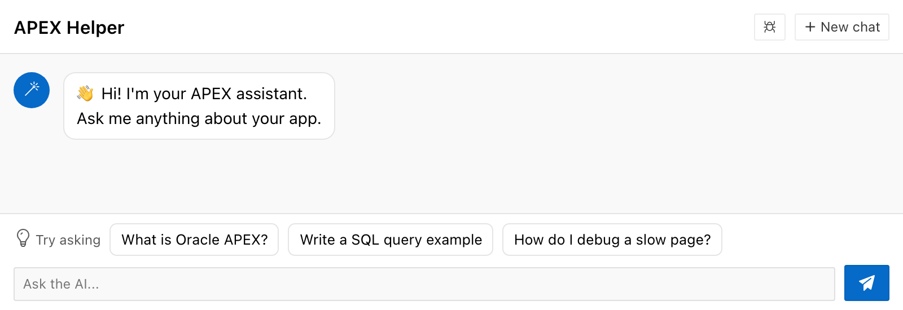
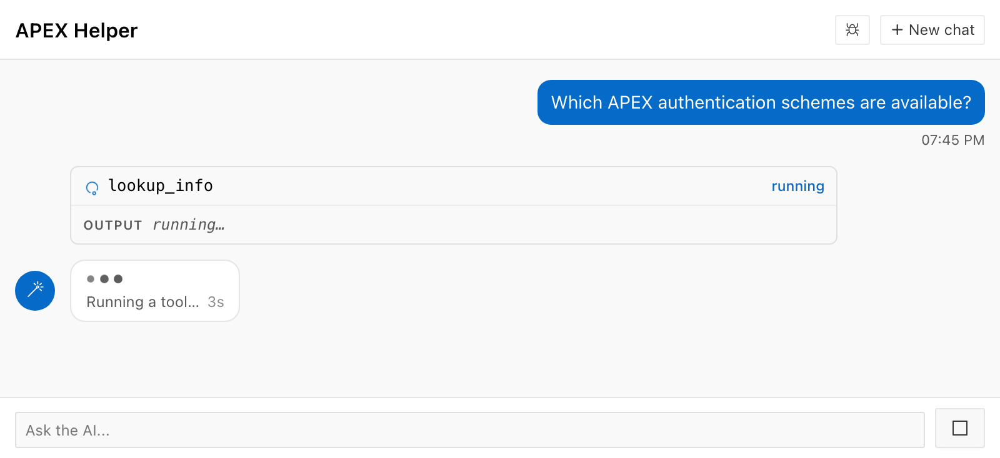
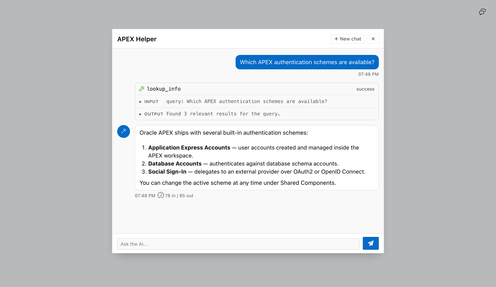

import { Aside, Steps, LinkCard } from "@astrojs/starlight/components";

The APEX Chat plug-in is an Oracle APEX region plug-in. It gives a UC AI agent a
chat interface. You set one attribute, the agent code, and the region works.

The plug-in does the parts that are difficult to build: it runs the agent in a
background job, it polls for the answer, and it keeps the conversation.



<Aside type="note" title="Where to get the plug-in">
The plug-in is not part of the UC AI installation. It is a separate download.
Ask United Codes for the plug-in files.
</Aside>

## Why the agent needs a background job

A run takes seconds. An agent with tools takes longer. A page submit that waits
five seconds blocks the user, and a gateway can stop the request before the
model answers.

The plug-in never makes the page wait. One message goes through these steps:

1. The browser sends the message. The plug-in writes a row and starts a
   `dbms_scheduler` job. The request returns at once.
2. The job calls `uc_ai_agents_api.execute_agent` and writes the answer, the
   tool calls, and the reasoning to the same table.
3. The browser polls every 2 seconds. It stops when the turn is complete.

[Lesson 8 of the tutorial](/products/uc-ai/docs/tutorial/build-an-agent/08-apex-page/)
builds this pattern by hand. Read that lesson to learn how the pattern works. Use
the plug-in when you want the pattern without the code.

## Before you start

You need these three things:

- **UC AI 26.4 or later** in the database schema. The package of the plug-in
  calls `execute_agent` with the parameter `p_run_context`, which is new in this
  version. On an older version the package body does not compile.
- An agent with the status `active`. See
  [Profile agents](/products/uc-ai/docs/guides/multi-agent-systems/profile-agents/).
- Permission to create a `dbms_scheduler` job in the schema.

## Install the plug-in

<Steps>

1. ### Create the table

   Run `src/ddl/ai_tables.sql`. This script creates `uc_ai_chat_messages`, which
   holds every message of every conversation.

   If the table exists from an earlier version, run the `alter table` blocks at
   the end of the same script instead.

2. ### Install the packages

   Run `src/plsql/uc_ai_chat.pks` and `src/plsql/uc_ai_chat.pkb`. The package
   body calls `uc_ai_agents_api`, so UC AI must be installed first.

3. ### Import the plug-in

   Import the plug-in export file into your APEX application. The file is a
   normal APEX component export.

4. ### Optional: show the tool progress

   Install `src/plsql/uc_ai_chat_hook.pks` and `.pkb`. With this package, the
   chat shows the name of the tool that runs now.

   If UC AI is in a different schema, grant `execute` on the hook package to
   that schema. Without the grant the plug-in leaves this feature off.

</Steps>

## Add a chat region to a page

<Steps>

1. ### Create a region

   Create a new region and set its type to **UC AI Chat**.

2. ### Set the agent

   Set **Agent Code** to the code of your agent. This attribute is the only
   required one.

3. ### Run the page

   The region shows the welcome message and the message box. Send a message.

</Steps>


The region above has the tool calls, the reasoning, the token counts, and the
feedback buttons on. **Debug Config** controls the first three. **Collect
Feedback** controls the buttons, and it is off by default. The feedback row has
a line of its own below the answer and stays on screen. The user does not have
to move the pointer on the message to find it. The question goes away after the
user clicks a thumb. A thumbs down also opens a box for an optional comment.

While the agent runs, the region shows an indicator. The indicator can also give
the name of the tool that runs now.



The send button becomes a Stop button while the agent runs. A stop before the
job starts costs no tokens.

## Region attributes

The plug-in has 18 attributes. **Agent Code** is the only one that you must fill
in. Six more attributes are required, but each one has a default value.

### Agent

| Attribute | Type | Default | What it does |
| --- | --- | --- | --- |
| **Agent Code** | Text | — | The code of the agent. This attribute is required. |
| **Agent Version** | Number | active version | Locks the region to one version of the agent. Use it to hold a known-good version while you write a new one. |
| **Agent Input Mapping** | Textarea | `{"message": "#USER_MESSAGE#"}` | A JSON template for the input parameters of the **first** message. `&ITEM.` gives the value of a page item. `#USER_MESSAGE#` gives the text of the user. Later messages of the same conversation use the history instead. |
| **Session Init Code** | PL/SQL | — | PL/SQL that runs in the background job, before the agent. The job has no APEX session, so anything the agent needs must start here. |

The scheduler job has no APEX session of its own. As a result, UC AI records the
database user and the audience `db`. To give the run the real APEX user, attach a
session in **Session Init Code**:

```sql
apex_session.attach(
  p_app_id     => :APP_ID,
  p_page_id    => :APP_PAGE_ID,
  p_session_id => :APP_SESSION
);
```

This step is necessary for every guardrail with the scope `user`, `each_user`,
`app`, `apex_session`, `public`, or `authenticated`. Without it, only a `global`
guardrail with the audience `any` governs a chat turn.

### Run context

| Attribute | Type | Default | What it does |
| --- | --- | --- | --- |
| **Agent Run Context** | Textarea | — | A JSON object that binds the conversation to one record. Every tool of the run gets these values under the key `_ctx`. |
| **Run Context Drift** | Select List | `ignore` | What the plug-in does when the values change during a conversation. |

The [run context](/products/uc-ai/docs/guides/tools/#the-run-context) is the way
to make a chat region talk about one contract, one case, or one tenant. The model
cannot read these values and cannot change them.

```json
{
  "contract_id": "&P10_CONTRACT_ID.",
  "tenant_id": "&APP_USER."
}
```

Leave the bound value out of the parameters of the tool. The handler then reads
`_ctx` and there is one place the value can come from.

UC AI binds the run context on the first turn of a conversation. A later turn can
add a key. A later turn cannot change a key. This rule protects the conversation:
the messages, and any memory files, belong to the first binding.

A page item can change while the chat is open. **Run Context Drift** decides what
happens then:

| Value | What happens |
| --- | --- |
| `error` | The plug-in refuses the turn. A notice tells the user to start a new chat. Nothing is lost without a decision from the user. |
| `new_session` | The plug-in starts a new conversation with the new values. This value is correct for a page about one record. The old messages are gone. |
| `ignore` | The plug-in keeps the first binding and ignores the change. |

<Aside type="caution" title="The run context binds the arguments of a tool, not the tools themselves">
A bound `DOC_SEARCH` tool gives no protection when the same agent also has a tool
that can read any table. Give the agent only the tools it needs.
</Aside>

### Conversation

| Attribute | Type | Default | What it does |
| --- | --- | --- | --- |
| **Session Item** | Page Item | — | A page item that holds the session ID. The chat continues this conversation after a page submit. Leave it empty for a conversation that starts again on every page load. |
| **Suggested Prompts** | Textarea | — | Example questions, one for each line. They show as buttons above the message box, with the label "Try asking", while the conversation is empty. A click sends the question immediately. Each button shows the full question. |
| **Auto Generate Title** | Checkbox | `N` | Names the conversation after the first answer, with the language model of the browser. |
| **Collect Feedback** | Checkbox | `N` | Shows a row with the question "Was this helpful?" and two thumb buttons below the newest answer. |

**Auto Generate Title** uses the on-device model of the browser (Chrome 148 or
later). No text goes to a server and the run costs no tokens. The plug-in never
starts the download of the model. If the model is not available, the region keeps
the configured **Header Title**.

The title goes to `uc_ai_agent_sessions.title`. The rating goes to
`uc_ai_agent_sessions.feedback_rating`, with `feedback_comment` and
`feedback_at`. `uc_ai_agents_api.list_sessions` returns all four columns, so one
query gives you the conversations with a negative rating.

### Appearance

| Attribute | Type | Default | What it does |
| --- | --- | --- | --- |
| **Display Mode** | Select List | `region` | `region` puts the chat in the page. `dialog` shows a small button that opens the chat in a dialog. |
| **Header Title** | Text | `UC AI Chat` | The title in the header of the chat. |
| **Welcome Message** | Textarea | `Ask me anything...` | The first message of the assistant, while the conversation is empty. |
| **Avatar Icon** | Icon | `fa-robot` | The icon of the assistant, and the icon of the button in dialog mode. |
| **Min Height** | Text | `450px` | The minimum height of the region. |
| **Thinking Animation** | Select List | `dots` | The animation during a run: `dots`, `braille`, `plasma`, or `matrix`. |
| **Thinking Detail** | Select List | `status` | How much the indicator says: `off`, `status`, or `tools`. |

With `display_mode` set to `dialog`, the region becomes a small button. A click
on the button opens the chat above the page.



**Thinking Detail** controls one line of text under the animation. The value
`status` gives `Thinking…` and the elapsed seconds. The value `tools` also tells
a tool run apart from a model run, with `Running a tool…`.

The indicator never gives the name of the tool. The tool row above it already
carries the name, so a name here is the same text two times.

To keep tool names away from the user, use **Debug Config**. With `show_tools`
off, no tool row reaches the browser at all. A tool name is an internal
identifier and can tell a user more about your system than you want.

The value `off` removes the text for the eye only. A screen reader gets the
announcement at every level, because a visual preference must not remove the only
signal that a run is active.

The attributes above control the chat. The frame around it is an ordinary APEX
region, and the region template decides that frame. The chat has a header, padding and
a scroll area of its own. A region with the default template repeats all three.

To give the chat the whole region, set the region template to **Standard** and
turn on these template options:

- **Remove Header** — the chat has a header of its own.
- **No Padding** — the messages then reach the edges of the region.
- **Scroll Body** — the conversation scrolls inside the region, and the page
  stays where it is.

The screenshots on this page use all three.

### Developer

| Attribute | Type | Default | What it does |
| --- | --- | --- | --- |
| **Debug Config** | PL/SQL Function Body | reasoning, tools, and metadata are on | A function that returns JSON. The JSON decides which parts the user sees. |

The function returns up to five flags:

- `show_reasoning` — the reasoning of the model, above each answer.
- `show_tools` — each tool call, with its arguments, its result, and its status.
- `show_metadata` — the token counts next to each answer.
- `show_debug` — a panel with the details of the run.
- `show_errors` — the text of an error, instead of a general message.

Every flag is `false` when the attribute is empty, when the function raises an
error, or when the JSON is not valid.

The flags work on the server. When a flag is `false`, the plug-in removes those
rows and fields from the response. The hidden content never reaches the browser,
so a modified client cannot show it.

Because this attribute is a function, one region can show different things to
different people:

```sql
if apex_authorization.is_authorized('ADMIN_AUTH') then
  return '{ "show_reasoning": true, "show_tools": true, "show_debug": true }';
else
  return '{}';
end if;
```

## Guardrails

The plug-in makes the verdicts of the [UC AI Pro
guardrails](/products/uc-ai/docs/guides/guardrails/) visible. Without the Pro
packages, this feature does nothing.

| Notice | When it shows |
| --- | --- |
| Approaching | A limit is past its warn threshold. The user can close the notice. |
| Reached | A hard limit refused the turn. The notice also shows on the failed answer. |

The plug-in never enforces a limit. The database guardrail stays the only
enforcer. The notices give no figure, no percentage, and no name of a limit.

## Security

- **The region decides which agent runs.** The plug-in compares the agent code in
  the request against the region's own attribute and refuses a request that names
  a different agent. Without this check, a user of the application can make the
  region run any agent in the schema.
- **One user owns one conversation.** After the first message, only the user who
  sent it can read the conversation or add to it.
- **The answer is sanitized.** The plug-in shows the answer as Markdown. It
  removes dangerous HTML before the browser gets it.
- **Errors stay in the database.** A failure of the background job writes the
  full error to the APEX debug log. The user gets a general message, unless
  `show_errors` is on.

## Version history

The current plug-in needs UC AI 26.4, because the package body calls
`p_run_context`. This table gives the version that introduced each feature:

| Feature | UC AI version |
| --- | --- |
| Chat region, tools, reasoning | 26.1 |
| Auto Generate Title, Collect Feedback | 26.3 |
| Agent Run Context, Run Context Drift | 26.4 |

<LinkCard
  title="The run context"
  description="How a bound value reaches every tool of a run, and why the model must not choose it."
  href="/products/uc-ai/docs/guides/tools/#the-run-context"
/>

<LinkCard
  title="Build the pattern yourself"
  description="Lesson 8 of the tutorial writes the queue, the job, and the poll by hand."
  href="/products/uc-ai/docs/tutorial/build-an-agent/08-apex-page/"
/>
