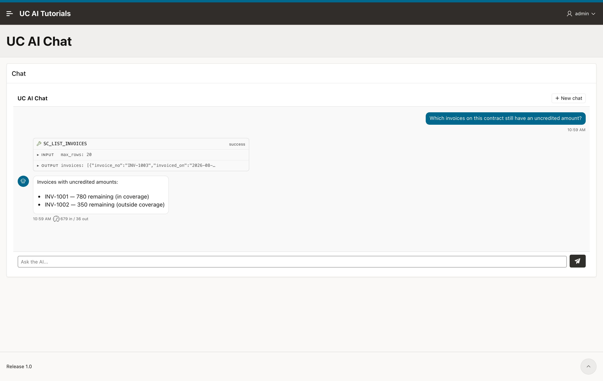

import { Aside, Steps, LinkCard } from "@astrojs/starlight/components";
import LessonHeader from "../../../../components/LessonHeader.astro";
import AiOutput from "../../../../components/AiOutput.astro";

<LessonHeader
  lesson={2}
  of={6}
  minutes={25}
  promise="the chat answers about the contract the page is on, and you can prove it cannot read another one."
  scripts={["00_setup.sql"]}
  course="apex-chat"
/>

## The problem

At the end of lesson 1 the chat worked and still could not answer. The tool
refused with `NO_CONTRACT`, because nothing had told the desk which contract the
page is about.

You could put the contract number in the question. Do not. Then the model chooses
the contract, and a user who types "show me contract 99 instead" gets contract
99.

The application must choose, and the model must not be able to change that
choice.

## The run context

The **run context** is a set of name and value pairs that belong to the run. UC
AI gives them to every tool of that run, under the key `_ctx`. The model never
sees this key and cannot set it.

Add one region attribute. Open the **Run Context** group and set **Agent Run
Context** to:

```json
{
  "contract_id": "&P10_CONTRACT_ID.",
  "engineer": "&APP_USER."
}
```

`P10_CONTRACT_ID` is the page item that holds the record the page is on. On a
real page it comes from the report the user clicked. For this course, add a
hidden item `P10_CONTRACT_ID` with a computation at **Before Header** that sets
the static value `88`.

<Aside type="note" title="Two attributes that look alike">
**Agent Input Mapping** (lesson 1) and **Agent Run Context** are both JSON with
`&ITEM.` values, and they do different jobs.

- Input mapping fills the **first** message of a conversation. Later messages use
  the conversation history instead.
- Run context is sent on **every** message, and it reaches the tools.

Put the question in the input mapping. Put the record in the run context.
</Aside>

## Keep the conversation across page loads

Set **Session Item** in the **Conversation** group to a hidden page item, for
example `P10_SESSION_ID`.

The plug-in writes the conversation id into that item and reads it back on the
next page load. Without it, every page load starts a new conversation. Lesson 5
depends on this, so set it now.

## What you get

Ask the same question as lesson 1:

> Which invoices on this contract still have an uncredited amount?

<AiOutput model="gpt-5.6-terra" date="2026-08-25" seconds={4.1}>
Invoices with uncredited amounts:

- INV-1001 — 780 remaining (in coverage)
- INV-1002 — 350 remaining (outside coverage)
</AiOutput>



The same question, the same agent, the same tool. The only new thing is one
region attribute, and now the desk reads your tables.

The plug-in stores what it sent:

```sql
select run_context
  from uc_ai_chat_messages
 where role = 'user'
 order by id desc
 fetch first 1 rows only;
```

```
{"contract_id":"88","engineer":"ADMIN"}
```

`&P10_CONTRACT_ID.` and `&APP_USER.` are resolved on the server, while the APEX
session is live. The browser never sends these values, so a user cannot change
them.

## Prove it, without asking the model

"Ask for another contract and watch it refuse" proves only that the model
declined. That is not a control.

Call the tool handler yourself, twice, with a different contract in `_ctx` each
time. The tool has no contract parameter, so `_ctx` is the only thing that
changes:

```sql
declare
  function invoices(p_contract in varchar2) return clob is
  begin
    return sc_desk_pkg.list_invoices(
      json_object_t('{"max_rows":20,"_ctx":{"contract_id":"'
        || p_contract || '"}}').to_clob);
  end;
begin
  sys.dbms_output.put_line('88 -> ' || invoices('88'));
  sys.dbms_output.put_line('99 -> ' || invoices('99'));
end;
/
```

```
_ctx contract_id = 88      -> 3 invoices
     INV-1003
     INV-1001
     INV-1002
_ctx contract_id = 99      -> 1 invoices
     INV-2001
```

Contract 88 and contract 99 belong to **different customers**. The same tool,
with the same arguments, returns one customer's invoices or the other's, and the
only thing that decides is the value the application put in the run context.

That is the control. It holds whatever the user types, because the user cannot
reach `_ctx`.

## Check it yourself

```sql
select m.role, m.tool_name, m.run_context
  from uc_ai_chat_messages m
 order by m.id desc
 fetch first 4 rows only;
```

The `user` row carries the run context. The `tool_result` row carries invoices of
contract 88 and no other contract.

## Key takeaways

- The run context binds a conversation to one record. The model cannot see it and
  cannot change it.
- Leave the bound value **out** of the tool parameters. Then there is one place
  the value can come from.
- Prove the boundary by calling the handler with a forged `_ctx`, not by asking
  the model to misbehave.

**Full reference:** [The run
context](/products/uc-ai/docs/guides/tools/#the-run-context) explains how `_ctx`
reaches a tool, and how memory can be scoped by one of its keys.

<LinkCard
  title="Next lesson: See what the chat did"
  description="The rows behind a turn, and how to tell a slow turn from a failed one from an empty one."
  href="/products/uc-ai/docs/tutorial/apex-chat/03-see-what-it-did/"
/>
