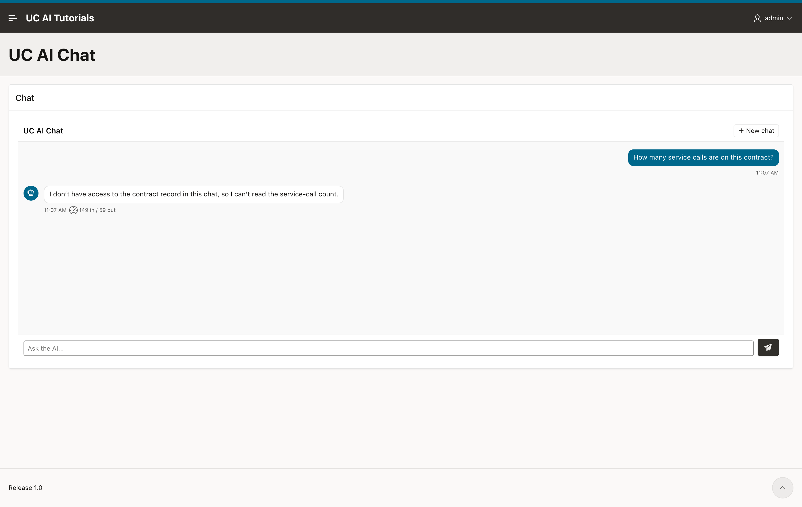

import { Aside, Steps, LinkCard } from "@astrojs/starlight/components";
import LessonHeader from "../../../../components/LessonHeader.astro";

<LessonHeader
  lesson={6}
  of={6}
  minutes={25}
  promise="the region is configured for people who are not you, and every run records who asked."
  scripts={["00_setup.sql"]}
  course="apex-chat"
/>

## The problem

Everything so far was built for you. The region shows tool calls, reasoning and
token counts, the audit trail says a background job ran the agent, and nobody has
told you whether any of the answers were any good.

Three attributes fix that.

## Show developers more than users

**Debug Config** is a PL/SQL function that returns JSON. Lesson 3 used it to see
error text. It is also an authorization check, because it runs on the server for
each request:

```sql
if apex_authorization.is_authorized('ADMIN_AUTH') then
  return '{ "show_reasoning": true, "show_tools": true,
             "show_metadata": true, "show_errors": true }';
else
  return '{}';
end if;
```

An admin sees the tool calls. Everyone else sees the answer and nothing else.

This is not a display setting. When a flag is false, the plug-in **removes those
rows from the response on the server**, so the browser never receives them. A
user who opens the developer tools finds nothing, because there is nothing there.

<Aside type="caution" title="Clearing the box turns everything off">
The shipped default has reasoning, tools and metadata **on**. Clearing the box
does not reset it to something sensible: an empty attribute means every flag is
false, so all the detail disappears at once.

Set the function you want. Do not empty the box to "start again".
</Aside>

Tool names deserve a thought of their own. `SC_LIST_INVOICES` is harmless.
`GET_HR_SALARIES` tells a user something about your system that you may not have
meant to publish. `show_tools` is what controls that.

## Record who really asked the question

Lesson 3 showed the audit trail saying the wrong thing:

```
ID    STATUS     AUDIENCE  CREATED_BY        APEX_USER  APP  PAGE
5294  completed  db        APEX_PUBLIC_USER
```

`created_by` is the database user, `audience` is `db`, and there is no APEX user
at all. That is honest — the agent runs in a background job, and a job has no
APEX session — but it is useless for "who asked this?".

Set **Session Init Code**, in the **Agent** group:

```sql
apex_session.attach(
  p_app_id     => :APP_ID,
  p_page_id    => :APP_PAGE_ID,
  p_session_id => :APP_SESSION
);
```

That runs inside the job, before the agent. The item values are resolved while
the browser request is still alive, so the job knows which session to join.

Send another message and run the same query as lesson 3:

```
ID    STATUS     AUDIENCE       CREATED_BY        APEX_USER  APP  PAGE
5350  completed  authenticated  ADMIN             ADMIN      777    10
5294  completed  db             APEX_PUBLIC_USER
```

The run now records the person, the application and the page.

<Aside type="note" title="Guardrails start applying from this turn">
If you use the UC AI Pro guardrails, this line changes which ones apply. Before
it, a chat turn is a database caller, so only limits scoped `global` with the
audience `any` govern it. After it, every limit scoped to a user, an application
or a session starts to apply.

That is what you want. Know that it happens on the turn you add this attribute,
not later.
</Aside>

## Ask whether the answer was any good

Set **Collect Feedback** in the **Conversation** group.

A thumbs up and a thumbs down appear under the newest answer. They are quiet: no
dialog, nothing blocks the page, and only a small share of users will ever press
one. That is the intent. It is a quality signal, not a survey.



One verdict is stored for each conversation, on the session:

```sql
select session_id, feedback_rating, feedback_comment, feedback_at
  from uc_ai_agent_sessions
 where feedback_rating is not null
 order by feedback_at desc;
```

`uc_ai_agents_api.list_sessions` returns the same columns, so "list the
conversations people were unhappy with" is one query. That is the report worth
building first: it points at the prompts and the tools that need work.

## Check it yourself

Send one message as an admin and one as a normal user, then compare what left the
server:

```sql
select role, count(*)
  from uc_ai_chat_messages
 where session_id = :your_session
 group by role;
```

With `show_tools` off, the `tool_call` and `tool_result` rows are still in the
table — they are just never sent to that user. The audit trail stays complete
while the screen stays clean.

## Key takeaways

- **Debug Config** is an authorization function, and the filtering happens on the
  server: `if apex_authorization.is_authorized('ADMIN_AUTH') then ...`
- **Session Init Code** with `apex_session.attach` turns `audience = db,
  created_by = UC_AI` into `audience = authenticated, created_by = ADMIN`.
- One feedback verdict is stored for each conversation, and `list_sessions`
  returns it.

## What to read next

- The [APEX Chat plug-in](/products/uc-ai/docs/guides/apex-chat-plugin/) guide
  lists all 18 region attributes, including the ones this course did not use.
- [Guardrails](/products/uc-ai/docs/guides/guardrails/) cap what a chat region can
  spend, for each user or for the whole application.
- [Agent memory](/products/uc-ai/docs/guides/agent-memory/) gives the desk a
  memory of each contract that survives the conversation.
