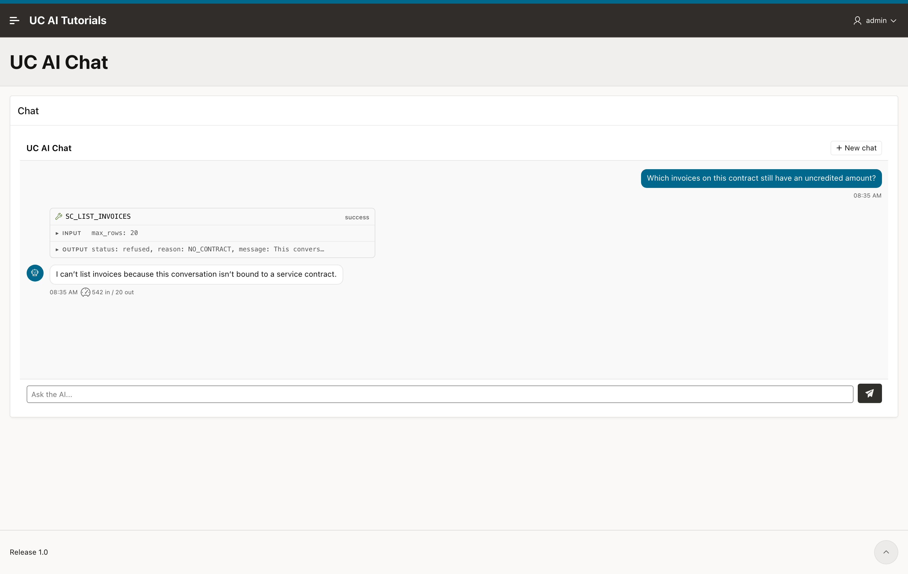

import { Aside, Steps, LinkCard } from "@astrojs/starlight/components";
import LessonHeader from "../../../../components/LessonHeader.astro";
import AiOutput from "../../../../components/AiOutput.astro";

<LessonHeader
  lesson={1}
  of={6}
  minutes={20}
  promise="an APEX page has a working chat region. The first message has no contract."
  scripts={["00_setup.sql"]}
  course="put-an-agent-in-apex"
/>

## What you build in this course

You build a chat page. An engineer opens one service contract, asks the desk a
question about it, and gets an answer from your own tables.

The agent already exists. This course is about the part in front of it: the
region, what it sends, what it stores, and what it lets a user see.

By the end you have a chat region that answers about one contract and no other,
that keeps each user's conversation private, and that you can debug when it goes
quiet.

## Before you start

You need **UC AI 26.3 or later**, installed and able to reach a model. If a call
works, you are ready. If it does not, the [installation
guide](/products/uc-ai/docs/guides/installation/) covers the network and key
setup.

The plug-in package calls `execute_agent` with `p_run_context`, which is new in
26.3, so it does not compile on an older version.

You also need the plug-in itself. It is attached to the [latest UC AI
release](https://github.com/United-Codes/uc_ai/releases/latest).

<Aside type="note" title="You do not need the first course">
This course uses the service-contract desk from [Build an
Agent](/products/uc-ai/docs/tutorial/build-an-agent/01-the-scenario/). The
setup script below creates all of it, so you can start here.

If you completed Build an Agent, this setup resets its demo data. It drops and
recreates the six `sc_*` tables and replaces `sc_desk_pkg`. It also updates
`SC_DESK_PROFILE` version 1, its model configuration, and the four tool
registrations. It activates version 1 of the profile and agent.

Use a separate demo schema if you need to retain your earlier data or
configuration. The script sets the profile tool tags to `scdesk`, which removes
the memory tag added in Build an Agent.
</Aside>

Run the setup script once:

```sh
sql your_user/your_password@your_db @00_setup.sql
```

It ends with a report. Every line must pass before you go on. To remove
everything again later, run `00_teardown.sql` from the same directory.

```
Tables      : 6 of 6
Package     : valid
Tools       : 4 of 4
Agent SC_DESK: active
Setup OK. Start lesson 1.
```

<Aside type="caution" title="An archived agent looks like a broken plug-in">
The last lesson of the first course uses `change_status` to archive an agent as a
kill switch. An archived agent is invisible to a call that does not name a
version, so the region fails and nothing on the page says why.

The line `Agent SC_DESK: active` above is the check. If it says anything else,
run this:

```sql
begin
  uc_ai_agents_api.change_status(
    p_code    => 'SC_DESK'
  , p_version => 1
  , p_status  => 'active'
  );
  commit;
end;
/
```
</Aside>

## Install the plug-in

<Steps>

1. ### Create the table

   Run `ai_tables.sql` from the plug-in files. It creates
   `uc_ai_chat_messages`, which holds every message of every conversation.

2. ### Install the package

   Run `uc_ai_chat.pks` and then `uc_ai_chat.pkb`. The package body calls UC AI,
   so UC AI must be installed first.

3. ### Import the plug-in

   Import the plug-in file into your APEX application, the same way you import
   any other component.

</Steps>

## Add the region

<Steps>

1. ### Create the region

   Create a new region on your page. Set its type to **UC AI Chat**.

2. ### Name the agent

   Open the **Agent** group of the region attributes and set **Agent Code** to
   `SC_DESK`.

   This is the only attribute you must fill in. The rest have defaults.

3. ### Give the agent its values

   The desk expects three values on the first message: who is asking, what the
   date is, and the question. Set **Agent Input Mapping** to:

   ```json
   {
     "engineer_name": "&APP_USER.",
     "today": "&P10_TODAY.",
     "question": "#USER_MESSAGE#"
   }
   ```

   `&APP_USER.` is the APEX user. `#USER_MESSAGE#` is what the user typed. Both
   are put into the JSON safely, so a quote in a question cannot break it.

4. ### Add the date item

   `&P10_TODAY.` needs a value. Create a hidden page item `P10_TODAY`, then add a
   **computation** on it with the point **Before Header** and this expression:

   ```sql
   to_char(sysdate, 'YYYY-MM-DD')
   ```

</Steps>

<Aside type="caution" title="Use a computation, not an item default">
The plug-in resolves `&P10_TODAY.` **on the server**, when your message arrives,
and it reads the value from session state. A value that exists only in the
browser is not in session state, so the plug-in gets nothing and the agent stops
with a missing-value error.

A computation writes to session state. The item looks correct on the page either
way.
</Aside>

## Send the first message

Run the page and ask the desk a question about the contract:

> Which invoices on this contract still have an uncredited amount?

## Response without a contract ID

<AiOutput model="gpt-5.6-terra" date="2026-08-25" seconds={3.3}>
I can't list invoices because this conversation isn't bound to a service contract.
</AiOutput>

The turn finished. The model called the tool, the tool refused, and the model
explained the refusal.



The tool result:

```json
{
  "status": "refused",
  "reason": "NO_CONTRACT",
  "message": "This conversation is not bound to a service contract, so I cannot list its invoices."
}
```

The tools of this desk have no contract parameter. The model cannot name a
contract, because there is nothing to name it in. The contract comes from the
application, and so far the application has not given one.

That is what the next lesson adds.

## Check it yourself

The answer text will differ on your run. What must match is the sequence of rows
the plug-in stored:

```sql
select role, turn_status, tool_name, input_tokens, output_tokens
  from uc_ai_chat_messages
 order by id desc
 fetch first 4 rows only;
```

```
ROLE           TURN_STATUS   TOOL_NAME           INPUT_TOKENS  OUTPUT_TOKENS
assistant                                                 542             20
tool_result                  SC_LIST_INVOICES
tool_call                    SC_LIST_INVOICES
user           done
```

Four rows for one message. The `user` row carries the status of the whole turn,
and `done` means the turn finished. A refusal is a result, not an error.

## Key takeaways

- One attribute makes a chat region work: **Agent Code**.
- The plug-in stores every part of a turn in `uc_ai_chat_messages`, one row for
  each: the question, each tool call, each tool result, and the answer.
- `&P10_TODAY.` needs a **computation**, because the plug-in reads page items on
  the server: `to_char(sysdate, 'YYYY-MM-DD')`.

**Full reference:** the [APEX Chat
plug-in](/products/uc-ai/docs/guides/apex-chat-plugin/) guide lists every region
attribute with its type and default.

<LinkCard
  title="Next lesson: Give the chat one contract to work on"
  description="The region attribute that binds a conversation to one record, and how to prove it cannot read another."
  href="/products/uc-ai/docs/tutorial/put-an-agent-in-apex/02-one-contract/"
/>
